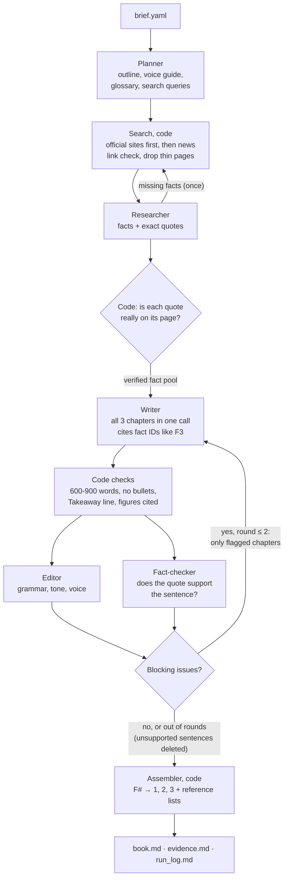

# Pay Me on UPI: a multi-agent book writer

A small multi-agent system that researches and writes a three-chapter book, *Pay Me on UPI: How Digital Payments Changed Small Business in India*, for first-time small-business owners. Every fact carries a numbered citation to a real, working, publicly accessible source.

**One idea drives the design:** the model decides *what* to say and judges quality; code fetches every source, verifies every quote and builds every citation. The Writer never types a URL or a reference number, so it cannot invent a source.

## Architecture



### The agents

| Agent | Job | Output |
|---|---|---|
| **Planner** | Turns the brief into a plan everyone follows | 3 chapter plans (goal, key points, facts needed, search queries), a shared **voice guide** and a **glossary** of terms to explain |
| **Researcher** | Reads the fetched pages and pulls out facts | Fact pool: claim + **exact quote** + page ID; a `missing` list of gaps with follow-up queries |
| **Writer** | Writes all chapters from the outline and fact pool; revises flagged chapters | Chapters citing fact IDs (`[F3]`) and a `Takeaway:` line |
| **Editor** | Grammar, spelling, jargon, tone, the same voice across chapters | Notes with an excerpt and a concrete fix, marked `must_fix` or `nice_to_have` |
| **Fact-checker** | Code: links load and quotes are really on the page. Model: each quote supports its sentence; no uncited claims | A verdict per sentence: `supports` / `partly` / `does_not_support` / `uncited_claim` |

### How the agents work together

- **Shared state.** Agents never call each other. Each one reads from and writes to a single `BookState`, and `orchestrator.py` decides who runs next. The state is saved to `output/state.json` after every step.
- **Tools are run by code, not by the model.** Agents ask for tools through their structured output. The Planner returns search queries and the Researcher returns `missing` gaps; code then runs the searches. The number of model calls is fixed and predictable.
- **Feedback loops.** The Editor and Fact-checker review in parallel. Their blocking notes, plus any failed code checks, are merged into one list of fixes per chapter, and the Writer revises **only the flagged chapters**. Approved chapters are frozen.
- **Stop rules.**
  - The system stops when every chapter is approved, or after **2 revision rounds**.
  - After the last round, code deletes any sentence that is still unsupported or uncited, so a fact never ships without a citation. Other leftover issues become warnings in `run_log.md`.
  - The gap-fill research round runs at most once.
  - There is a hard cap of **15 model calls** per run.

### Why citations can be trusted

1. Sources come only from search results. Official domains (NPCI, RBI, PIB, ministries) are searched first. A pass over an allowlist of reputable news sites runs only if a chapter has fewer than 4 usable official pages.
2. Broken links (404, DNS errors) are dropped before research starts.
3. Each fact must include words copied from its page, and code checks those words really appear there. Facts that fail are dropped.
4. The Writer can only cite fact IDs from the verified pool. Code turns the IDs into `[1]`, `[2]` and writes the reference list (source, title, URL).
5. The Fact-checker checks that every cited sentence is actually supported by its quote.
6. `output/evidence.md` lists, for every cited sentence, the source, the exact supporting quote and the Fact-checker's verdict, so a reviewer can audit the citations in minutes.

## Cost

Everything runs on free tiers: **Gemini API** (Google AI Studio) and **Tavily** (1,000 search credits a month).

| | Gemini calls |
|---|---|
| Best case: Planner, Researcher, Writer, Editor, Fact-checker | **5** |
| Worst case: gap-fill research + 2 revision rounds | **12** |
| Hard cap | 15 |

A run uses about 20–40 Tavily credits. Batching is what keeps the numbers low: the Writer, Editor and Fact-checker each handle the whole book in a single call, rather than one call per chapter. Code handles everything mechanical for free (word counts, formatting, links, quote matching, numbering), and model replies and search results are cached on disk, so re-running finished steps costs nothing.

Model choice: `gemini-3.8-flash` for planning, writing and judging, and `gemini-3.5-flash-lite` for bulk fact extraction. Both can be changed in `.env`.

The book in `output/` was planned by `gemini-3.8-flash`, but the newer Flash models kept returning 503 "high demand" on the Writer step, so that run was resumed with `SMART_MODEL=gemini-3.5-flash`. `--resume` let it pick up from the saved state without repeating any searches or finished calls.

## Running it

Requires Python 3.10+.

```bash
python -m venv .venv
.venv\Scripts\activate          # Windows  (macOS/Linux: source .venv/bin/activate)
pip install -r requirements.txt
cp .env.example .env            # then add GEMINI_API_KEY and TAVILY_API_KEY
```

| Command | What it does |
|---|---|
| `python main.py` | Writes the book from `brief.yaml` |
| `python main.py --resume` | Continues a stopped run from `output/state.json` |
| `python main.py --check-links` | Re-tests every reference link in `output/book.md` |
| `python main.py --revise 2` | One extra Writer pass for a chapter that finished with warnings, then a normal review |
| `pytest` | Runs the unit tests (no API keys needed) |

Get keys from https://aistudio.google.com/apikey and https://app.tavily.com.

### Outputs (in `output/`)

- `book.md`: the finished book
- `evidence.md`: every citation with its source quote and verdict
- `run_log.md`: every hand-off between agents, the calls used, and any warnings
- `state.json`: the full shared state (outline, sources, facts, verdicts)

## Project structure

```
main.py            entry point and CLI flags
orchestrator.py    order of agents, revision loop, stop rules
assemble.py        builds book.md / evidence.md / run_log.md (no model calls)
config.py          models, limits, thresholds
brief.yaml         the brief, plus preferred official and news domains
agents/            planner, researcher, writer, editor, fact_checker (one prompt + one function each)
core/              state models, Gemini and Tavily wrappers, link checker, rule checks, text helpers
tests/             unit tests for quote matching, rule checks and citation assembly
docs/design.md     design decisions and trade-offs
```

## Design decisions and trade-offs

- **Plain Python instead of an agent framework.** Every loop and stop condition is visible in under 300 lines of `orchestrator.py`, with nothing hidden in a framework.
- **Separate Editor and Fact-checker** rather than one merged reviewer. It costs one extra call per round, but citation accuracy is the most important criterion and gets a dedicated, focused prompt. The two run in parallel, so it isn't slower.
- **One Writer call for all chapters,** which keeps the voice consistent and costs less than one call per chapter.
- **Gemini's built-in Google Search grounding was not used,** because it returns redirect links rather than the original URLs and doesn't provide page text to verify quotes against.

## Known limitations

- Some sites block scripts. For example, NPCI returns 403 to every automated request. A bot-blocked page is kept only if the search service actually fetched its text, and `--check-links` reports such links as `BLOCKED` so you can open them in a browser to confirm.
- Pages built entirely by JavaScript (such as live dashboards) return little text and are skipped. Static press releases and PDFs are used instead.
- Quote matching is exact after normalising case, punctuation and spacing, so a fact quoted from a PDF with unusual line breaks may be rejected even though it is correct.
- Figures such as monthly UPI volumes go out of date. The Writer is told to state the period each figure refers to.
